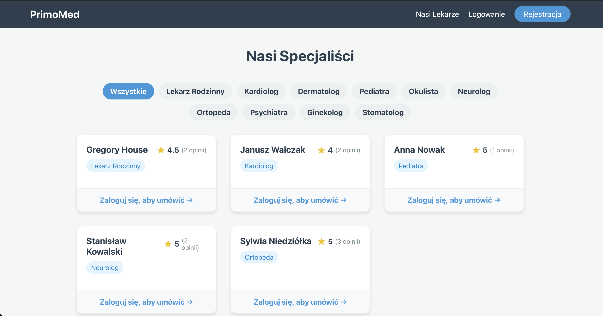
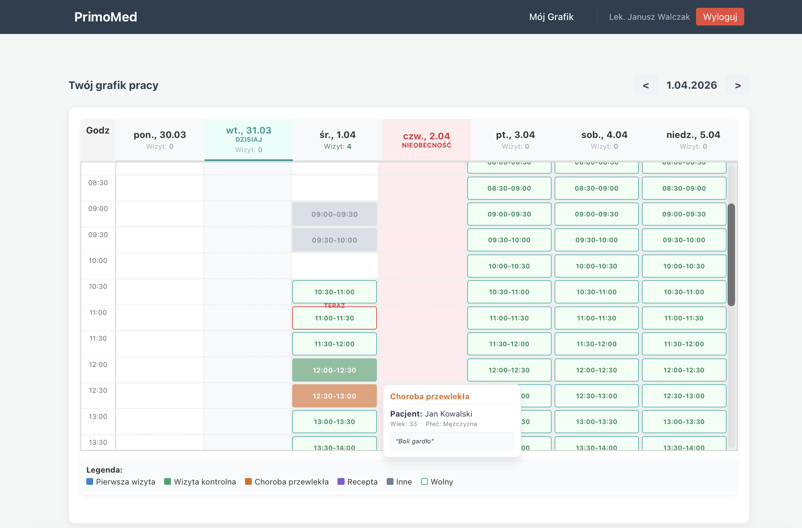
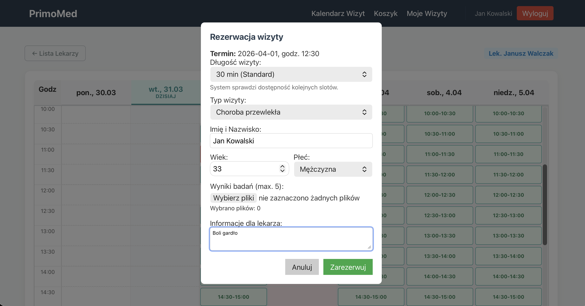

# Medical Clinic Management System 🏥

A comprehensive, full-stack web application built for managing a modern medical clinic. This project was developed to facilitate the interaction between patients, doctors, and clinic administrators, offering a complete flow from finding a specialist to booking an appointment and leaving a review.

<p align="center">
  
  &nbsp;
  
  &nbsp;
  
</p>

## 🚀 Features

The system provides role-based access control with distinct interfaces and functionalities for three main user types:

### 👤 Patients
- Browse available doctors filtering by specialization.
- View doctor profiles, schedules, and verified reviews.
- Book medical appointments (integrated cart/checkout simulation).
- Manage own upcoming and past appointments.
- Leave ratings and reviews for doctors after completed visits.

### 👨‍⚕️ Doctors
- Interactive dashboard to manage availability.
- Define single or cyclical working schedules.
- Report absences and days off.
- View upcoming booked appointments with patients.

### 🛡️ Administrator
- Manage platform users (create doctor accounts).
- Oversee and moderate doctor ratings and reviews.
- Configure global authentication settings for the platform.

### ⚡ Technical Highlights
- **Real-time Updates:** Integration of WebSockets (`Socket.io`) for real-time notifications.
- **Secure Authentication:** JWT-based user authentication and bcrypt password hashing.
- **File Uploads:** Profile picture and document handling via `multer`.
- **Relational Database:** SQLite managed via `Sequelize` ORM, complete with automated data seeding for quick local setup.

---

## 💻 Tech Stack

**Frontend:**
* React 19 (Hooks, Functional Components)
* TypeScript
* Vite (Build tool)
* React Router v7
* React Bootstrap (UI Framework)

**Backend:**
* Node.js & Express.js
* Sequelize ORM (SQLite)
* Socket.io (WebSockets)
* JSON Web Tokens (JWT) & bcryptjs
* Multer (File uploads)

---

## 🛠️ Getting Started

### Prerequisites
Make sure you have Node.js (v18 or higher recommended) installed on your machine.

### Installation & Setup

1. **Clone the repository:**
   ```bash
   git clone <repository-url>
   cd medical-app
   ```

2. **Backend Setup:**
   ```bash
   cd medical-app-backend
   npm install
   npm start
   ```
   *The backend will start on `http://localhost:5001`.*
   *Note: On the first run, the database is automatically synced and seeded with dummy data.*

3. **Frontend Setup:**
   Open a new terminal window:
   ```bash
   cd medical-app-frontend
   npm install
   npm run dev
   ```
   *The frontend will be available at `http://localhost:5173`.*

### 🔑 Default Credentials

Upon the first backend initialization, an admin account is automatically generated:
* **Username/Login:** `admin`
* **Password:** `admin123`

*(Other test accounts like doctors or patients might be available depending on the `seed.js` script configuration).*

---

## 🎓 About The Project
This project was developed as a university assignment to demonstrate practical skills in full-stack web development, database architecture design, RESTful API creation, and modern frontend component design using React and TypeScript.
